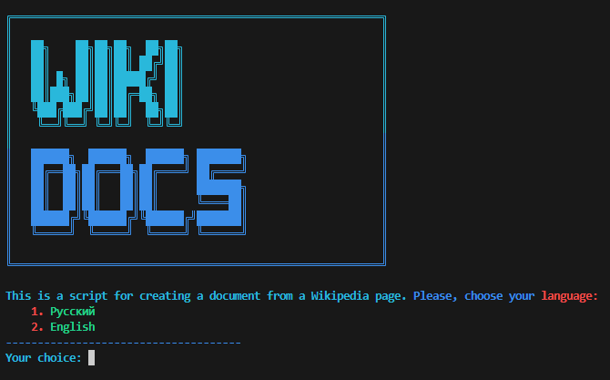
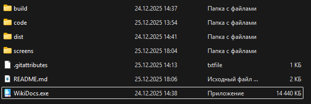

# AutoWiki

## 🌟 About project
**AutoWiki** — This is a console application for automatically generating structured reports in .docx format from Wikipedia articles. The program simplifies the process of collecting and formatting information for academic and work tasks.

# Screenshots

## Functions

### This application has 2 modes of operation:
- 📖 Creating reports on the link

- 📖 Creating reports based on a keyword from a Wikipedia article

### Application have 2 interface-languages:

- ✅ Русский
- ✅ English

## Short guide

- ❗ For start, start the **wikidocs.exe** and forward the instructions, after all, the script close and you can check result in documents/document.py

- To start the app, click on the **WikiDocs.exe**

- ⚙️ If you have any problems, report bug and restart script

- 👀 Check the correctness of the entered data

